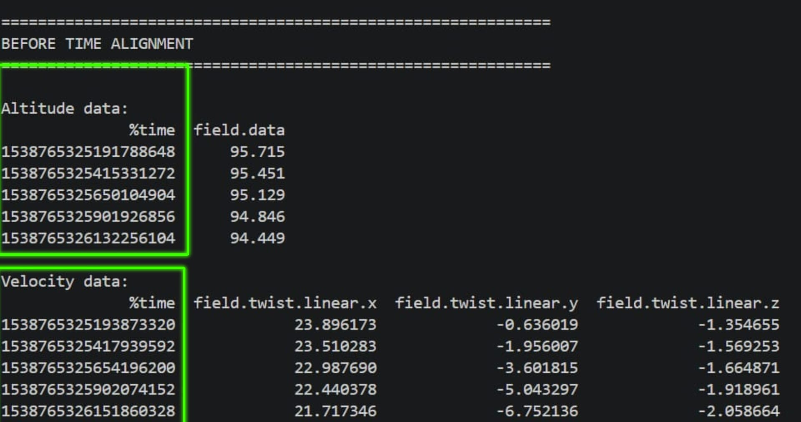
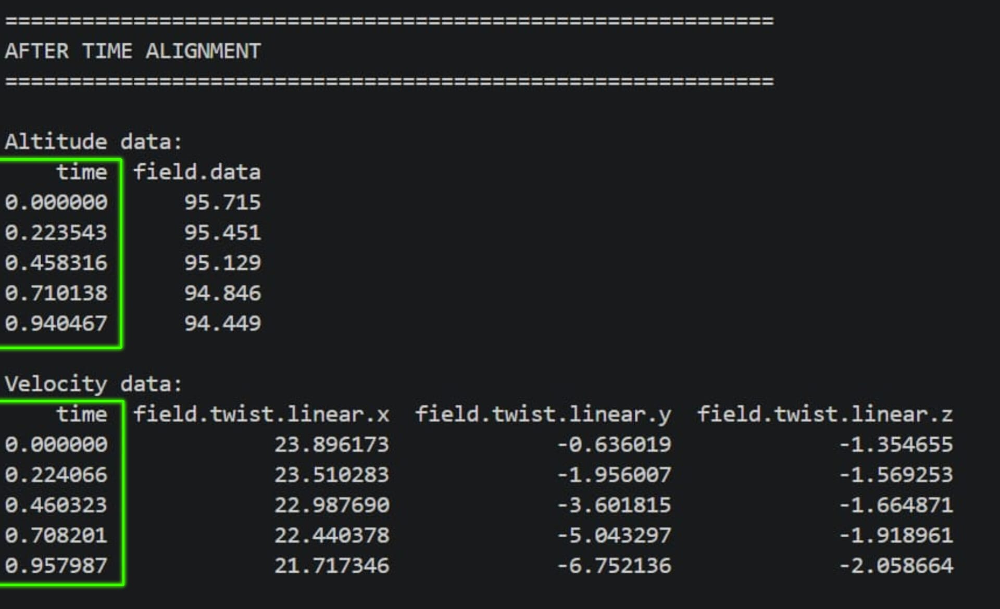
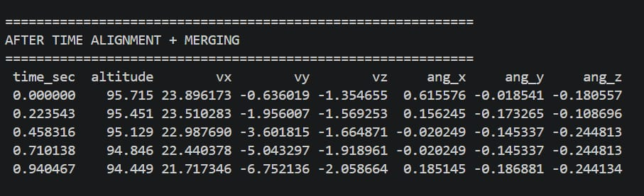
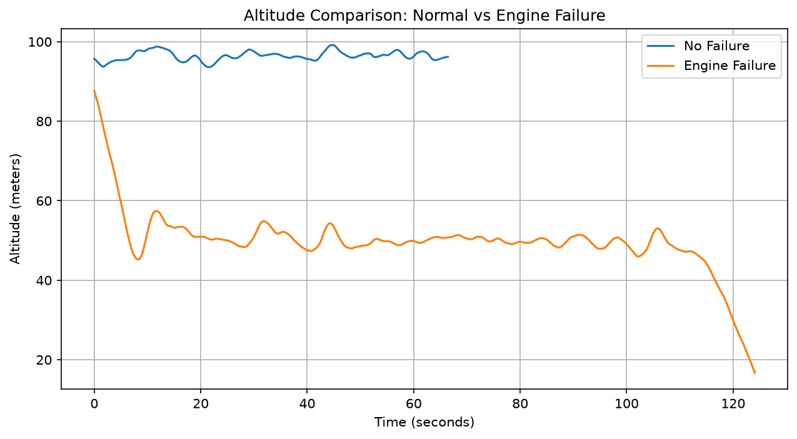
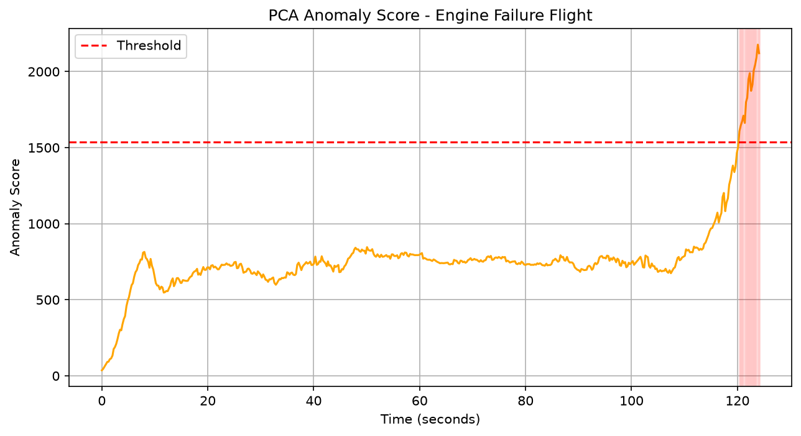
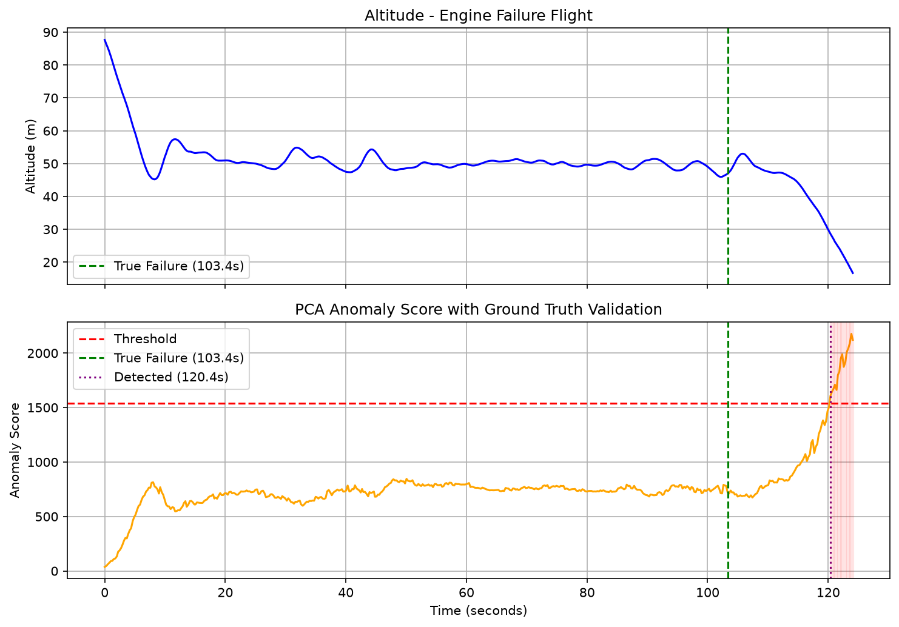

# UAV Flight Anomaly Detection Using PCA

## Objective

In this project, I analyzed real fixed-wing drone flight sensor data to detect in-flight failures automatically, without being told in advance when or if a failure occurred. The pipeline consists of several stages:

* Extracted and cleaned real UAV telemetry data (altitude, velocity) from the ALFA dataset.
* Aligned multiple independently logged sensor streams into a single time-synced dataset using Python.
* Modeled normal flight behavior using PCA (Principal Component Analysis), and used it to score how abnormal each moment of a failure flight was.
* Validated the model's detected failure point against the dataset's official ground-truth failure timestamp.

As this project is focused on analysis and detection methodology, the emphasis is on data cleaning, signal processing, and validating results against ground truth.

The sections below explain the dataset, tools, process, and results in more detail.

## Table of Contents

* [Dataset Used](#dataset-used)
* [Technologies](#technologies)
* [Process](#process)

  * [Step 1: Data Cleaning and Alignment](#step-1-data-cleaning-and-alignment)
  * [Step 2: Modeling Normal Flight Behavior](#step-2-modeling-normal-flight-behavior)
  * [Step 3: Anomaly Detection](#step-3-anomaly-detection)
  * [Step 4: Validation Against Ground Truth](#step-4-validation-against-ground-truth)
* [Results](#results)
* [What I'd Improve With More Time](#what-id-improve-with-more-time)

## Dataset Used

This project uses the **ALFA (Air Lab Failure and Anomaly) Dataset**, built by Carnegie Mellon University's AirLab and published at ICRA 2019 / IJRR 2021. It contains real recorded flights of a fixed-wing UAV, including flights with intentionally induced failures (engine loss, control surface faults) and normal flights for comparison, along with official ground-truth timestamps for when each failure occurred.

More info about the dataset can be found here:

* Website: https://theairlab.org/alfa-dataset/
* GitHub (tools + docs): https://github.com/castacks/alfa-dataset

Signals used from the dataset:

* `mavros/global_position/rel_alt` - relative altitude (m)
* `mavros/local_position/velocity` - linear and angular velocity
* `failure_status/engines` - ground-truth engine failure status, used for validation only

## Technologies

The following tools were used to build this project:

* **Language:** Python
* **Data cleaning & alignment:** pandas, numpy
* **Modeling:** scikit-learn (StandardScaler, PCA)
* **Visualization:** matplotlib

## Process

### Step 1: Data Cleaning and Alignment

Each sensor logs independently and at a different rate, using raw Unix nanosecond timestamps. I converted timestamps to seconds relative to flight start, then merged the altitude and velocity readings using nearest-timestamp matching (`pandas.merge_asof`) into a single aligned table per flight. This was necessary since the two sensors don't record at the exact same moments.

<p align="center">
  
</p>

<p align="center">
  
</p>

<p align="center">
  
</p>

### Step 2: Modeling Normal Flight Behavior

Using only a flight with no failure, I standardized 7 signals (altitude, 3-axis velocity, 3-axis angular velocity) and fit a PCA model on them. This teaches the model the normal relationship between these signals during healthy flight, rather than a fixed "safe range" for any single sensor.

<p align="center">
  
</p>

### Step 3: Anomaly Detection

For the failure flight, I projected each moment's signals into PCA space and reconstructed them back. The reconstruction error at each timestamp becomes an anomaly score. The larger the error, the more that moment's behavior deviates from what PCA learned as normal. A detection threshold (mean + 3 standard deviations) flags the point where the score first becomes abnormal.

<p align="center">
  
</p>

### Step 4: Validation Against Ground Truth

The dataset includes an official record of the exact moment the engine failure was triggered. I compared this ground-truth timestamp against my model's detected anomaly point to check real-world accuracy, rather than relying on visual guesswork.

<p align="center">
  
</p>

## Results

* The flight's altitude dropped twice: once early on (~8 seconds in), and again later (~110 seconds in, ending in a crash).
* It would be easy to assume the early drop was the failure because it is the more visually dramatic point in the raw altitude data.
* **Ground truth confirmed the actual engine failure occurred at 103.4 seconds**, meaning the early drop was unrelated and was simply normal flight behavior.
* The PCA-based anomaly score correctly stayed within a normal range during the early drop, and only crossed the detection threshold around 110-120 seconds. **This caught the real failure within roughly 10-15 seconds of actual onset**, while correctly ignoring the misleading early change.

This confirms the method detects genuine abnormal aircraft *behavior*, not just any altitude change. It provides a more reliable signal than a simple threshold on one sensor.

## What I'd Improve With More Time

* Incorporate additional signal channels (roll, pitch, yaw, actuator outputs) to improve detection for fault types that affect orientation more than altitude.
* Test the same method against the dataset's other fault types (aileron, rudder, elevator failures) to check how well it generalizes.
* Formally evaluate false positive / true positive rates across multiple flights rather than a single validated case.

## Repository Structure

```text
├── flight_anomaly_detection.py   # main analysis script
├── figures/                      # exported graphs
└── README.md                     # this file
```
